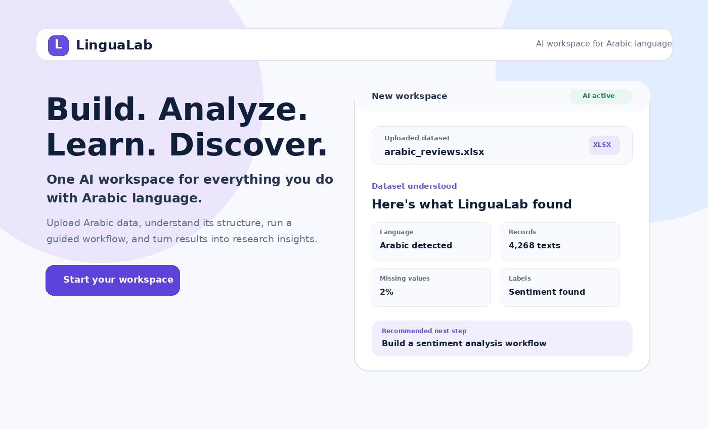
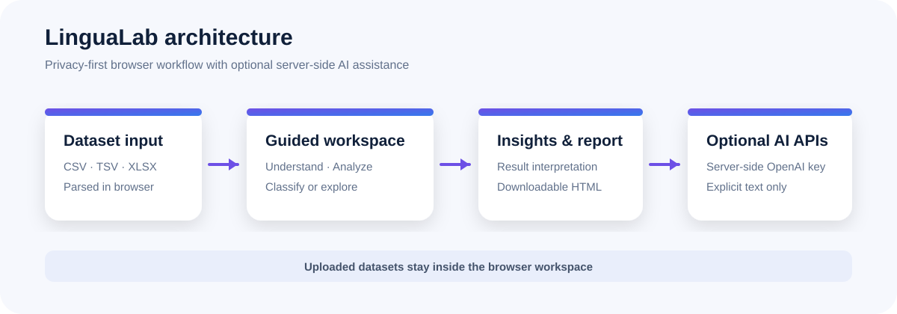

# LinguaLab
**Build. Analyze. Learn. Discover.**
🌐 Live Demo: https://lingualab-teal.vercel.app
An AI-powered research workspace created for OpenAI Build Week.

LinguaLab is an AI-powered research platform for Arabic computational linguistics. It combines dataset understanding, integrated corpus analysis tools, GPT-5.6-powered research assistance, and research reporting into a single guided workflow. It turns a fragmented process—spreadsheets, notebooks, scripts, separate visualizations, and chat tools—into one guided path from dataset upload to interpretable results and a research-ready report.



> **Release status:** `2.0.0` — Stable Build Week submission deployed to Vercel with production-ready AI features and public demonstration.

## Why LinguaLab

LinguaLab combines integrated corpus analysis tools with AI-powered research assistance, helping researchers move from dataset exploration to research planning, interpretation, and research-ready reports within a single workflow

The core competition workflow is:

```text
Upload → Understand → Choose a goal → Analyze → Interpret → Report
```

## What works today
Integrated corpus analysis tools for exploring Arabic-language datasets and supporting research-oriented analysis:

- Upload and parse **CSV**, **TSV**, and modern **XLSX** files.
- Detect likely text and label columns.
- Measure missing values, duplicates, Arabic-script coverage, and class distribution.
- Recommend a classification or corpus-exploration workflow.
- Run a browser-based text-classification baseline when labels are available.
- Explore document, token, vocabulary, word-frequency, and bigram statistics for unlabeled corpora.
- Convert results into dataset-specific insights, limitations, and suggested next steps.
- Download a self-contained HTML research report that can be printed to PDF.
- Use optional server-side OpenAI endpoints for text and code assistance.

  ## AI capabilities

LinguaLab integrates GPT-5.6 through secure server-side OpenAI endpoints to support research workflows without exposing API keys.

Current AI features include:

- AI Research Copilot for study design and methodology suggestions.
- AI Research Advisor for research planning and question refinement.
- AI Code Assistant for programming support.
- AI Prompt Builder for creating reusable research prompts.

## Privacy-first workspace

The guided dataset workflow runs in the browser. Uploaded datasets are parsed and analyzed locally and are not sent to LinguaLab's application server.

Only text explicitly submitted to the optional AI tools is sent to their server-side endpoints. The OpenAI API key remains server-side and must never use the `NEXT_PUBLIC_` prefix.

## Architecture



Read the detailed architecture notes in [`docs/ARCHITECTURE.md`](docs/ARCHITECTURE.md).

## Technology

- Next.js 16 Pages Router
- React 19
- OpenAI Responses API powered by GPT-5.6
- OpenAI JavaScript SDK
- read-excel-file for modern XLSX parsing
- Browser-side JavaScript for dataset understanding, baseline analysis, insights, and report generation
  
## Quick start

### Requirements

- Node.js `20.9.0` or newer
- npm

### Install

```bash
git clone <repository-url>
cd lingualab
npm ci
cp .env.example .env.local
```

Add an OpenAI API key only when testing the optional AI routes:

```env
OPENAI_API_KEY=your_openai_api_key_here
```

The main dataset workspace and demo do not require an API key.

### Run locally

```bash
npm run dev
```

Open `http://localhost:3000`.
The production deployment is available on Vercel for public evaluation.

### Production verification

```bash
npm run check
npm start
```

`npm run check` runs lint, a production build, and a high-severity dependency audit.

## Demo data

Use **Try demo dataset** in `/workspace`, or upload one of:

- `public/sample-datasets/arabic_reviews_demo.csv`
- `public/sample-datasets/arabic_reviews_demo.xlsx`

The balanced sample contains 30 Arabic reviews across positive, neutral, and negative labels. It is designed to make the full competition workflow easy to reproduce.

## Project structure

```text
components/       Shared UI components
pages/            Next.js routes and API endpoints
public/           Public assets and demo datasets
styles/           Global and page-level styles
docs/             Architecture and product documentation
.github/          Issue and pull-request templates
```

## Using Codex and AI-assisted development

LinguaLab is human-led and AI-assisted. The product vision, Arabic-language problem definition, user journey, feature decisions, testing direction, and final acceptance decisions were led by the project owner.

Codex and ChatGPT were used as development partners to accelerate:

- restructuring the product from a collection of tools into a unified workspace;
- implementing dataset understanding and guided workflows;
- building the baseline classification and corpus-exploration logic;
- generating interpretable insights and the downloadable report;
- debugging Excel and Arabic-text handling;
- upgrading dependencies, hardening API routes, and preparing the release candidate;
- documenting the architecture and release process.

This reflects an iterative build process: requirements were explained, implementations were tested, and the product was repeatedly revised based on domain and user-experience judgment.

## Current limitations

- Legacy `.xls` files are intentionally unsupported; convert them to `.xlsx` or CSV.
- The built-in classifier is an educational baseline, not a claim of state-of-the-art modeling.
- Final model quality depends on dataset size, labels, balance, and language variation.
- The downloaded report supports research exploration but does not replace scholarly validation.
- Browser and mobile support will continue to be refined in future releases.
## Roadmap

### Next planned improvements

- Add experiment persistence and comparison.
- Expand Arabic preprocessing and evaluation options.
- Improve accessibility and bilingual support.
- Introduce reusable research workspaces.

## Quality and security

The current release passes:

- ESLint with zero errors and warnings.
- Next.js production build.
- Runtime smoke tests for `/` and `/workspace`.
- `npm audit` with zero known vulnerabilities at the time of the production-readiness audit.

See:

- [`PRODUCTION_READINESS.md`](PRODUCTION_READINESS.md)
- [`TEST_RESULTS.md`](TEST_RESULTS.md)
- [`SECURITY.md`](SECURITY.md)
- [`CHANGELOG.md`](CHANGELOG.md)

## Contributing

See [`CONTRIBUTING.md`](CONTRIBUTING.md). The release-candidate priority is stability and a clear Arabic-language workflow rather than adding more features.

## License

Released under the [MIT License](LICENSE).

## Creator

** Jawharah Alasmari**  
Product vision, Arabic linguistics and computational-linguistics direction, UX design, evaluation methodology, testing, and AI-assisted product development using GPT-5.6 and Codex.
